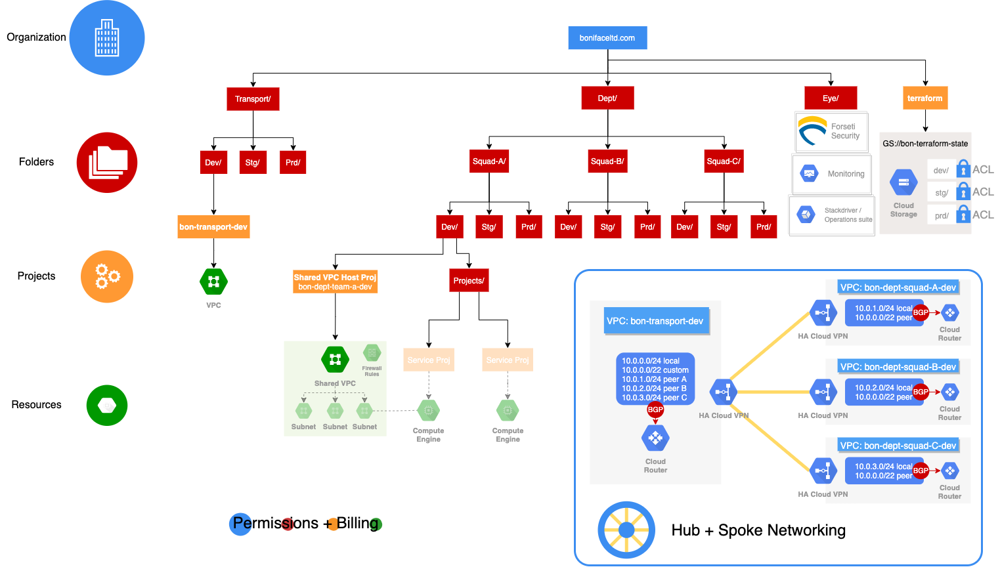

# GCP-Boniface-ORG  




## Setting up Organization

### 1: Cloud identity, domain and organization resource

> Cloud Identity Free edition includes core identity and endpoint management services.
> It provides managed Google Accounts to users who don’t need certain Google Workspace services, such as Gmail and Google Calendar

[info](https://support.google.com/cloudidentity/answer/7319251?hl=en) | [sign-up](https://cloud.google.com/identity/docs/setup#sign-up-for-the-free-edition-of-cloud-identity) | [admin-management](https://admin.google.com)

### **bonifaceltd.com	1077773425109**

### 2: users + groups

| Group Name           | Email                          | Description                                                                                                                                                                            |
|----------------|--------------------------------|----------------------------------------------------------------------------------------------------------------------------------------------------------------------------------------|
| org-admins     | org-admins@bonifaceltd.com     | Organization administrators are responsible for organizing the structure of the resources used by the organization.                                                                    |
| net-admins     | net-admins@bonifaceltd.com     | Network administrators are responsible for creating networks, subnets, firewall rules, and network devices such as cloud routers, Cloud VPN instances, and load balancers.             |
| billing-admins | billing-admins@bonifaceltd.com | Billing administrators are responsible for setting up billing accounts and monitoring their usage.                                                                                     |
| sec-admins     | sec-admins@bonifaceltd.com     | Security administrators are responsible for establishing and managing security policies for the entire organization, including access management and organization constraint policies. |
| devops         | devops@bonifaceltd.com         | DevOps practitioners create or manage end-to-end pipelines that support continuous integration and delivery, monitoring, and system provisioning.                                      |
| devs           | devs@bonifaceltd.com           | Developers are responsible for designing, coding, and testing applications.                                                                                                            |

### 3: Setting up administrator access

> Grant admin access to org-admins

| IAM area            | Role assigned                     |
|---------------------|-----------------------------------|
| Resource Manager    | Organization Administrator        |
| Resource Manager    | Folder Admin                      |
| Resource Manager    | Project Creator                   |
| Billing             | Billing Account User              |
| Roles               | Organization Role Administrator   |
| Organization Policy | Organization Policy Administrator |
| Security Center     | Security Center Admin             |
| Support             | Support Account Administrator     |

### 4: Setting up billing

#### Set up billing account

At this point terraform takes ownership
---

run [/bootstrap](./bootstrap)

[](https://asciinema.org/a/Wfi0wVP7RSLipFYJurxdhwd6A?t=3)

> Grant billing admin access to billing-admins

| IAM area         | Role to assign                |
|------------------|-------------------------------|
| Billing          | Billing Account Administrator |
| Billing          | Billing Account Creator       |

### 5: Setting up terraform core

- terraform project under the organisation

- houses "terraform states" bucket

- terraform service account

```
Apply complete! Resources: 40 added, 0 changed, 0 destroyed.

Outputs:

bucket = bon-terraform-state
project = bon-terraform-007-fbf5
svc_account = org-terraform@bon-terraform-007-fbf5.iam.gserviceaccount.com
```
---
